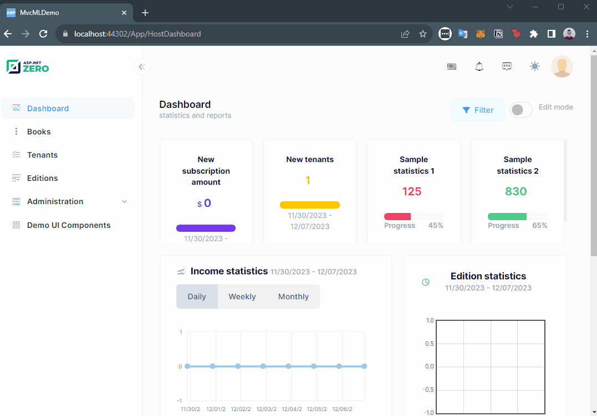

**Title:** Introducing ASP.NET Zero v.13.0
**Description:** ASP.NET Zero v13.0: Get ready to explore the latest enhancements in ASP.NET Zero! Multi-Lingual Entity Support, .NET 8, Angular 17, Metronic 8.2.0, GraphQL 7.x, and ABP 9.0 upgrades.

# Introducing ASP.NET Zero v13.0

Get ready to explore the latest enhancements in ASP.NET Zero! From multi-lingual entity support with power tools to upgraded versions of .NET, Angular, Metronic, GraphQL, and ABP. These updates are transforming the software development landscape. Join us as we delve into these exciting upgrades propelling ASP.NET Zero into a new era of innovation.

## Unlocking Power: Multi-Lingual Entity Support in Power Tools
Power Tools now boast Multi-Lingual Entity Support, revolutionizing language inclusivity. This upgrade enables seamless content display in diverse languages within a single interface. Say hello to a user-centric experience that transcends linguistic boundaries effortlessly.

### Why Multi-Lingual Entity Support Matters
Imagine a scenario where a tool can seamlessly adapt to users worldwide, speaking their language effortlessly. That's precisely what the upgrade to Power Tools, incorporating Multi-Lingual Entity Support, achieves. It empowers developers to create applications that transcend language barriers, opening doors to wider audiences and enhanced user experiences.

### How to Create Multi-Lingual Entity
* Open power tools.
* Fill the `Entity Informations`. (namespace, entity name, etc.)
* When create a new property, click on the `Multi Lingual Property` option.
* Click on the `Generate` button.
* That's it!

### Multi-Lingual Entity 

When you create a new entity with multi-lingual property, you will see the result! User friendly interface, fully customizable, and multi-lingual support.

## The .NET 8 Leap: Powering Tomorrow's Solutions
Speaking of upgrades, the transition to .NET 8 is a game-changer. With its improved performance, increased productivity, and enhanced security features.

## Embracing the Evolution: Upgrading to Angular 17
In the ever-evolving realm of web development, staying current is pivotal. Upgrading to Angular 17 elevates the user experience, streamlines development workflows, and reinforces the compatibility of Power Tools with cutting-edge technologies.

## Metronic 8.2.0: A Design Revolution
Design is not just about aesthetics; it's about functionality and user delight. The upgrade to Metronic 8.2.0 brings forth a design revolution, offering sleeker interfaces, enhanced customizability, and a plethora of features that elevate the visual appeal and usability of applications developed with Power Tools.

## GraphQL 7.x: Empowering Queries for Tomorrow's Data
The upgrade to GraphQL 7.x opens up new horizons for data querying and manipulation. It empowers developers using Power Tools to craft more efficient and precise queries, resulting in enhanced performance and a streamlined development process.

## ABP 9.0: Unveiling Enhanced Features
As the technological landscape evolves, so does ABP. Version 9.0 introduces a host of enhancements, refining the framework's capabilities.

## Conclusion
The world of technology is a perpetual journey of evolution and innovation. The upgrades to Power Tools introducing Multi-Lingual Entity Support, embracing .NET 8, Angular 17, Metronic 8.2.0, GraphQL 7.x, and ABP 9.0 in a new era of possibilities. They empower developers to create solutions that transcend boundaries, harnessing the power of language, performance, design, and functionality.

As we continue to embrace these advancements, the future of software development with Power Tools is not just promising but limitless, propelling us towards a landscape where technology speaks a language everyone understands.