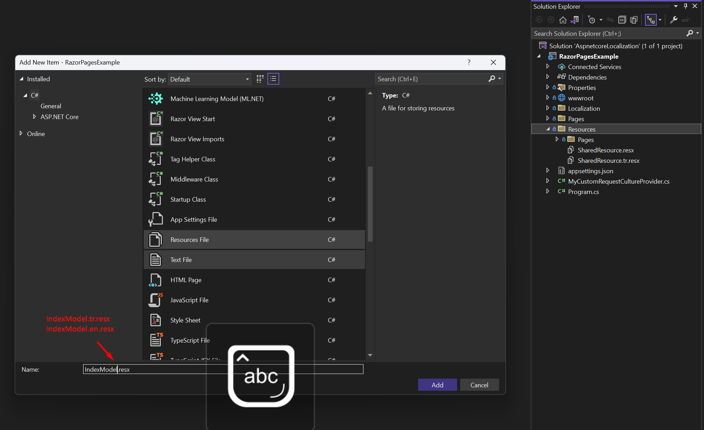
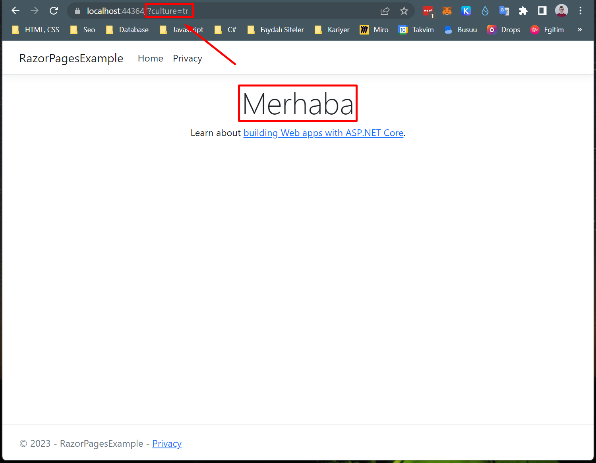

# Localization in ASP.NET Core

**Localization** is the process of adapting software to meet the **language** and **cultural requirements** of a particular **target market**. It involves **translating** text and adjusting other elements of a website or application to make it accessible and user-friendly for people from different regions and backgrounds.

In ASP.NET Core, **localization** is an **essential feature** that **enables** developers to create **multilingual** websites and applications. It provides a **straightforward** way to **create** and **manage** localized content, which can **improve** the **user experience** and make your application more **accessible** to a **broader audience**.

> To download the source code for this article, you can visit our [GitHub repository](https://github.com/CodeMazeBlog/CodeMazeGuides/tree/main/aspnetcore-features/Localization).

## Getting Started with Localization in ASP.NET Core

To start, **create** an Asp.Net Core application. You can **choose to use** either **Razor Pages** or **MVC** based on your preference.

### Configure Localization

Configure localization by adding the **following code** to either the `Program.cs` or `Startup.cs` file, as per your **application structure**, as **shown** in this [Microsoft documentation](https://learn.microsoft.com/en-us/aspnet/core/migration/50-to-60-samples?view=aspnetcore-7.0):

This code **configure** the **localization service** in the application and **specify** the **default** and **supported cultures** that will be used to **localize** the application's **content**.

The first section of the code **sets up** the **path** to the **localization resources**, which are typically **stored** in **files** such as **.resx** or **.json** files. The **AddLocalization** method is used to **register** the **localization service** with the **dependency injection** system.

```csharp
builder.Services.AddLocalization(options =>
{
    options.ResourcesPath = "Resources";
});
```	

The last section of the code **configures** the **request localization** options for the **application**. The **DefaultRequestCulture** property is set to the **default culture**, and the **SupportedCultures** and **SupportedUICultures** properties are set to the **array of supported cultures**.

```csharp
const string defaultCulture = "en";

var supportedCultures = new[]
{
    new CultureInfo(defaultCulture),
    new CultureInfo("tr")
};

builder.Services.Configure<RequestLocalizationOptions>(options => {
    options.DefaultRequestCulture = new RequestCulture(defaultCulture);
    options.SupportedCultures = supportedCultures;
    options.SupportedUICultures = supportedCultures;
});
```

Add **middleware** to the request **pipeline** by adding the **following code**:

```csharp
app.UseRequestLocalization();
```

### Create Localization Resources

The next step is to **create** the localization **resources** for your application. These resources **include** text strings, images, and other **content** that **needs to be localized**.

By **convention**, resource files **should be separated** into a separate folder called **Resources**. When **naming** these files, they should follow the **name of the class** that **will consume them**, as well as **include** the **language** they **represent**.

We can either **organize** the files into **separate folders**, such as Resources/Pages/IndexModel.resx, or leave them in the root **Resources folder**, **ensuring to name them appropriately**, in this case Resources/Pages.IndexModel.resx.

In the **.resx** file, you can add **key/value** pairs for each localized string or other resource. For example, you might add a key called **Greeting** with a value of **Bonjour** for **French** or **Merhaba** for **Turkish**.



### Access Localization Resources in Code

Localization in **Razor Pages** and **localization** in **MVC** are **very similar**.

Once you've created your localization resources, you can **access** them** in your code**. To do this, you'll need to **inject** an **instance** of the `IStringLocalizer<T>`, `IHtmlLocalizer<T>` or `IViewLocalizer<T>` (According to your requirement) interface into your class.

Here's an **example** of **how to access** a **localized string** in **C#**:

```csharp
using Microsoft.AspNetCore.Mvc.RazorPages;
using Microsoft.Extensions.Localization;

namespace RazorPagesExample.Pages;

public class IndexModel : PageModel
{
    private readonly IStringLocalizer<IndexModel> _localizer;

    public IndexModel(IStringLocalizer<IndexModel> localizer)
    {
        _localizer = localizer;
    }

    public void OnGet()
    {
        var message = _localizer["Message"];
        ViewData["Message"] = message;
    }
}
```

Here's an **example** of **how to use** localization in a **Razor view**:

```html
@page
@using Microsoft.Extensions.Localization
@model IndexModel
@inject IStringLocalizer<IndexModel> L

@{
    ViewData["Title"] = "Home page";
}

<div class="text-center">
    <h1 class="display-4">@L["Greeting"]</h1>
    <p>Learn about <a href="https://docs.microsoft.com/aspnet/core">building Web apps with ASP.NET Core</a>.</p>
</div>
```

Default language


Turkish language


## Asp.net Core Request Culture Providers

**Request Culture Providers** are a mechanism for **determining** the user's **preferred** culture based on **information provided** in the **HTTP request**. When a request is made to your application, the **Request Culture Provider** will examine the **request** headers and **query parameters** to **determine** the user's **preferred** culture.

There are **several** built-in **Request Culture Providers** in ASP.NET Core, including:

- `QueryStringRequestCultureProvider`: **Determines** the user's preferred culture **based** on a **culture** or **ui-culture** query parameter in the **request URL**. (default)
- `CookieRequestCultureProvider`: **Determines** the user's preferred culture **based** on a **cookie** set in the **user's browser**.
- `AcceptLanguageHeaderRequestCultureProvider`: **Determines** the user's preferred culture **based** on the `Accept-Language` **header** in the **request**.

### Using Request Culture Providers in ASP.NET Core
To use Request Culture Providers in your ASP.NET Core application, you'll need to **add** them to the `RequestLocalizationOptions` in your **application**.

```csharp
services.Configure<RequestLocalizationOptions>(options =>
{
    ...

    options.RequestCultureProviders = new List<IRequestCultureProvider>
    {
        new AcceptLanguageHeaderRequestCultureProvider()
    };
    options.RequestCultureProviders.Insert(0, );
});
```

### Custom Request Culture Provider
You can also create **custom** request culture **providers** to support **custom ways** of **determining** the user's preferred **culture**.

To create a custom **Request Culture Provider**, you'll need to implement the `IRequestCultureProvider` interface and **override** the `DetermineProviderCultureResult`(HttpContext) method. This method should return a `ProviderCultureResult` object that **contains** the user's preferred **culture**.

Here's an **example** of a **custom request culture provider** that determines the user's preferred culture based on a custom HTTP header:

```csharp
public class MyCustomRequestCultureProvider : RequestCultureProvider
{
    public override async Task<ProviderCultureResult?> DetermineProviderCultureResult (HttpContext httpContext)
    {
        await Task.Yield();
        return new ProviderCultureResult("tr");
    }
}
```

Add the **custom Request Culture Provider** to the `RequestLocalizationOptions` in your application:

```csharp
services.Configure<RequestLocalizationOptions>(options =>
{
    ...

    options.RequestCultureProviders = new List<IRequestCultureProvider>
    {
        new MyCustomRequestCultureProvider()
    };

});
```

## Localization in Data Annotations

Data annotations are **attributes** that are applied to **model properties** to specify how they should be **validated** and displayed. In ASP.NET Core, data annotations can be used to perform **validation** on model properties, such as **ensuring** that a property has a **minimum** or **maximum** value, or that it **matches a certain pattern**.

To **add localization** to **data annotations**, we need to create **resource files** for each language we want to support, and then apply the **appropriate** attributes to our model properties.

### Using Data Annotations in ASP.NET Core

Let's **consider** an example where we want to create a login form that includes an email field. We want to **ensure** that the **email address** and **password** is **required**.

```csharp
[Display(Name = "Email")]
[Required(ErrorMessage = "{0} is required")]
[BindProperty]
public string Email { get; set; }

[Display(Name = "Password")]
[Required(ErrorMessage = "{0} is required")]
[BindProperty]
public string Password { get; set; }
```

Let's create a simple **form** interface using **Bootstrap**. We'll use the **asp-for** attribute to **bind** the form **fields** to the **model** properties.

```html	
<div class="mt-2">
    <h1 class="mb-3">Data Annotations Example</h1>
    <form class="col-4">
        <div class="mb-3">
            <label asp-for="Email" class="form-label"></label>
            <input asp-for="Email" type="email" class="form-control" aria-describedby="emailHelp">
            <span asp-validation-for="Email" class="text-danger"></span>  
            <div id="emailHelp" class="form-text">We'll never share your email with anyone else.</div>
        </div>
        <div class="mb-3">
            <label asp-for="Password" class="form-label"></label>
            <input asp-for="Password" type="password" class="form-control" id="exampleInputPassword1">
            <span asp-validation-for="Password" class="text-danger"></span>  
        </div>
        <button type="submit" class="btn btn-primary">Submit</button>
    </form>
</div>

@section Scripts
{
    <partial name="Shared/_ValidationScriptsPartial"/>
}
```

Add data annotations localization to your application by calling the `AddDataAnnotationsLocalization` method.

```csharp	
builder.Services.AddRazorPages().AddDataAnnotationsLocalization();
```

Default language


Turkish language


## Using Shared Resources

In some cases, you may want to **share** localization **resources** **between pages**. For example, you may want to share a resource file that **contains common** strings, such as "Save", "Cancel", "Edit", "Delete", etc.

To share localization resources between pages, you'll need to **create** a **shared resource file**.


### Using Shared Resources in ASP.NET Core

Create a **custom** localizer that implements the `ISharedViewLocalizer` interface. This interface contains a `GetLocalizedString` method and key  that will be used to **access** the **shared resource file**.

```csharp
public interface ISharedViewLocalizer
{
    public LocalizedString this[string key]
    {
        get;
    }

    LocalizedString GetLocalizedString(string key);
}

public class SharedResource
{

}

public class SharedViewLocalizer : ISharedViewLocalizer
{
    private readonly IStringLocalizer _localizer;

    public SharedViewLocalizer(IStringLocalizerFactory factory)
    {
        var type = typeof(SharedResource);
        var assemblyName = new AssemblyName(type.GetTypeInfo().Assembly.FullName);
        _localizer = factory.Create("SharedResource", assemblyName.Name);
    }

    public LocalizedString this[string key] => _localizer[key];

    public LocalizedString GetLocalizedString(string key)
    {
        return _localizer[key];
    }
}
```

Once you've created your custom localizer, you can access them in your code. To do this, you'll need to **inject** an **instance** of the `ISharedViewLocalizer` interface into your **class** or **page**.

```html
@page

...

@inject ISharedViewLocalizer SharedLocalizer

...

<button type="submit" class="btn btn-primary">@SharedLocalizer["Save"]</button>
```

### Using Shared Resources in Data Annotations

To use shared resources in data annotations, you'll need to configure the `DataAnnotationLocalizerProvider`. This provider is used to **determine** which **resource** file to use for **data annotations**.

```csharp
builder.Services.AddRazorPages().AddDataAnnotationsLocalization(options =>
{
    options.DataAnnotationLocalizerProvider = (type, factory) =>
    {
        var assemblyName = new AssemblyName(typeof(SharedResource).GetTypeInfo().Assembly.FullName);

        return factory.Create("SharedResource", assemblyName.Name);
    };
});
```

## Asp.Net Zero Solution

Asp.Net Zero is a **starting point** for **new** web applications with a modern **architecture**, best **practices** and most used tools. It is a **framework** that can be used to **create** a new application from **scratch**.

Asp.Net Zero comes with **built-in** localization and **language management** capabilities, requiring **no setup** upon installation. You can manage your language files using **RESX**, **XML**, and **JSON** formats. Additionally, the language management page enables you to **add new languages** and **edit translations** for existing languages. With the **multi-tenancy** feature in Asp.Net Zero, your tenants can customize language **translations** according to their needs. For more information, please refer to our detailed [documentation](https://docs.aspnetzero.com/en/aspnet-core-mvc/latest/Features-Mvc-Core-Language-Management).

## Conclusion
In this article, we've **covered** the **basics** of implementing **localization** in an **ASP.NET Core** application. By adding localization **middleware**, creating localization **resources**, **accessing them in code**, and using them in **views**, you can create a **multilingual** website or application that's **accessible** to users.