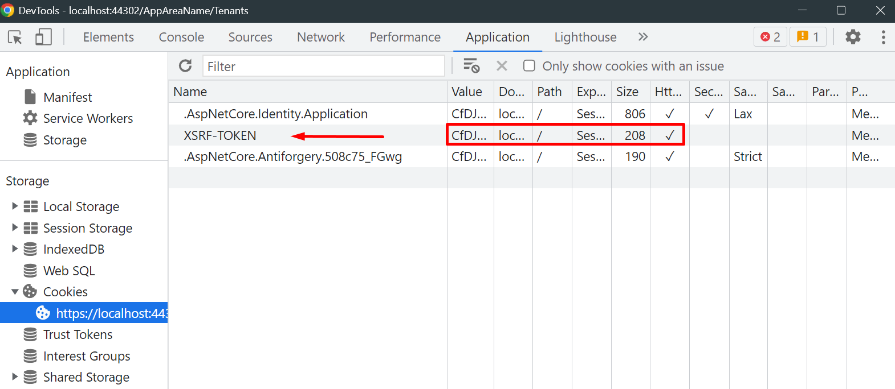

# Enhancing Security with HTTP-Only Anti-Forgery Tokens in ASP.NET Zero

In this article, we'll explore how to set **AntiForgery** cookie **HttpOnly** in ASP.NET Zero. We'll start by **explaining** what **AntiForgery** is and why it's **important**, then provide code examples to help you **implement** HttpOnly AntiForgery in **your** own **ASP.NET Zero** MVC projects.

First, let me explain what AntiForgery is and why it's important.

AntiForgery is a commonly used **security** measure in **web** applications. This method is used to **validate** that a user's **session** is still valid between one page and the next. This provides **protection** against **malicious individuals** taking over **sessions** or performing **fake** transactions.

So, what does making the AntiForgery cookie HttpOnly mean? HttpOnly means that a cookie **cannot be accessed by JavaScript**. This prevents malicious users from **accessing** the **cookie** with **JavaScript** code and **taking over** the **session**.

Now, we can create a project to make the AntiForgery cookie HttpOnly and add the incoming cookie to the **request headers** through **middleware**.

To make the AntiForgery cookie HttpOnly, update the following code inside `Layout\_Layout.cshtml`:

> **Note:** If you are using many layouts, you can add this code to all of them. (Example: `Account\Login.cshtml`)

```csharp
AbpAntiForgeryManager.SetCookie(Context, null, new CookieOptions
{
    HttpOnly = true
});
```

This code sets the AntiForgery cookie to be HttpOnly.

Next, we'll **create** a **middleware** to add the **incoming cookie** to the **request headers**. To do this, create a middleware class named `XsrfMiddleware` in the `Startup` folder of your project. Then, add the following code to the class:

```csharp
using Microsoft.AspNetCore.Builder;

namespace MvcAntiForgeryExample.Web.Startup;

public static class XsrfMiddleware
{
    public static IApplicationBuilder UseHttpOnlyAntiForgeryToken(this IApplicationBuilder app)
    {
        return app.Use(async (ctx, next) =>
        {
            var tokens = ctx.Request.Cookies["XSRF-TOKEN"];
            if (string.IsNullOrEmpty(tokens) == false)
            {
                ctx.Request.Headers.Add("X-XSRF-TOKEN", tokens);
            }
            await next();
        });
    }
}
```

Then add the following code to the `Configure` method of `Startup.cs`:

```csharp
public void Configure(IApplicationBuilder app, IWebHostEnvironment env)
{
    app.UseHttpOnlyAntiForgeryToken();

    .
    .
    .
}
```

That's it! With these changes, your application is now **more secure** against session **hijacking** and **fake transactions**.


