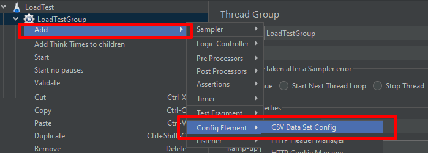
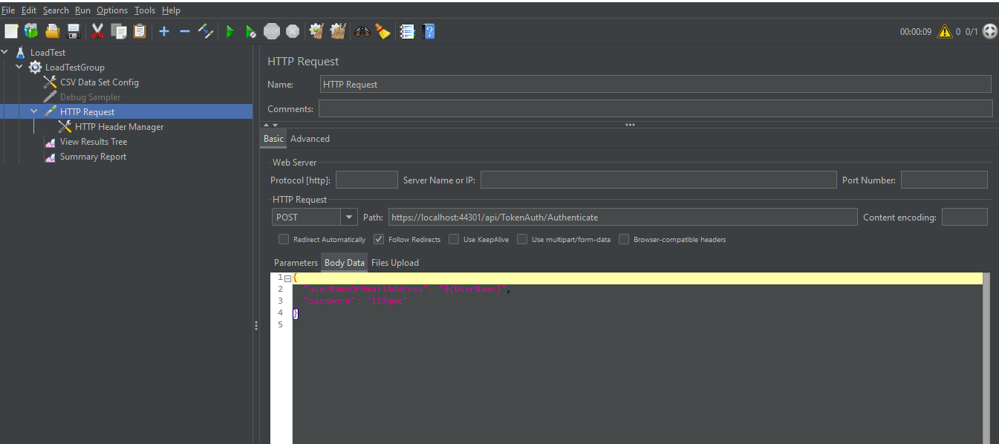

# Running Load Test on ASP.NET Zero

*Load testing* generally refers to the practice of modeling the expected usage of a software program by simulating multiple users accessing the program concurrently (from [Wikipedia](https://en.wikipedia.org/wiki/Load_testing)).

One of the most important part of a website is the login/authenticate endpoint. In this article, I will try to explain you how to load test authenticate endpoint on an ASP.NET Zero app. Although this article is for ASP.NET Zero, it can be applied to any ASP.NET Boilerplate app and even an ASP.NET Core app.

ASP.NET Zero is a starting point for new web applications with a modern UI and SOLID architecture, with full source code. If you want to know more about ASP.NET Zero, you can check its website [https://aspnetzero.com/](https://aspnetzero.com/).

## Create the project

Before starting the test, we need a web project to test. So, go to [https://aspnetzero.com/download](https://aspnetzero.com/download) page and create your project. If you are not an ASP.NET Zero customer, you can create a project on [https://aspnetboilerplate.com/Templates](https://aspnetboilerplate.com/Templates), create a project and use it as well. 

## Prepare Test Data

To test the authenticate endpoint, we need dummy user records. To do that, create a CSV file similar to the one in image below and create 500 rows. You can easily create two rows and scroll down to row 500 and Excel will create users with username admin1, admin2, admin3, etc...


If you are using ASP.NET Zero, you can easily import this excel to your database on User List page by using "Excel operations -> Import from Excel" action button.

After importing the user data, you can remove other columns than UserName and Password from the excel file and save it as a CSV file. We will use this final CSV file for our test.

## JMeter

The **Apache JMeter™** application is open source software, a 100% pure Java application designed to load test functional behavior and measure performance. We will use JMeter for our load test. So, go to [https://jmeter.apache.org/](https://jmeter.apache.org/) and download the latest version for your OS. 

### Thread Group

First add a Thread Group to your Test by right clicking the main test icon as shown below;


Then, set number of threads (users) to 500 and set Ramp-up period to 10. If you need to use a higher number of users, you can increase thread value but be sure to increase the user count in the previous CSV/Excel file we have created to the same number.

### CSV Data Set Config

Then, right click to thread group and add a CSV data set config as shown below;



Click the created CSV Data Set Config item and select the file we created in the previous step by using file browser on "Filename" field. After that enter "**UserName,Password**" to the variable names field and set ignore first line field to **True**. By doing this, we will be able to access columns of the CSV file by using its column names.

Before proceeding further, if you want to be sure that JMeter reads our CSV file, you can add a "Debug Sampler" item right under the CSV Data Set Config item and run the test once. Debug Sampler will log the values of the CSV file under the JMeter Variables section.

### HTTP Request

Since we are going to test an endpoint on a web app, we need to make an HTTP request to that endpoint. To do that, create a "HTTP Request" item right under the CSV Data Set Config item.

It should be a **POST** request and it should make a request to ```https://localhost:44301/api/TokenAuth/Authenticate``` endpoint. If your app uses a different port, you can change this URL as you wish. 

For each request we want JMeter to get the username & password pairs from the CSV file we selected before and sent those items to endpoint we defined. In order to do this, set BodyData of the HTTP Request as shown below;

````json
{
  "userNameOrEmailAddress": "${UserName}",
  "password": "${Password}"
}
````

#### HTTP Header Manager

We also need to configure "Content-Type" header for our HTTP Request. To do this, add a "HTTP Header Manager" under the HTTP Request item and add a new item to its headers list with the key "**Content-Type**" and value "**application/json**".

Finally, our HTTP Request configuration should be like this;



### Test Result

Finally, add "View Result Tree" which shows status for each request and "Summary Report" which shows a summary for the HTTP Requests.

Now, we are ready to execute the test. After executing the test, we can check each request and see its post data and result as shown below;


Or, we can check overall result of the test as shown below;


By following a similar approach, we can test other endpoints of our app. If the endpoint is an authenticated endpoint, we should get a token from Authenticate endpoint we tested above, store it in JMeter and send with the request for the endpoint we want to test. This can be the topic of another article.