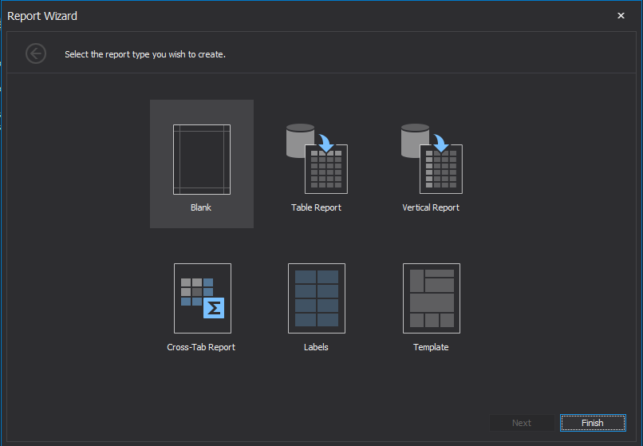

# DevExpress Reporting

In this document, we will integrate [DevExpress Reporting](https://www.devexpress.com/subscriptions/reporting/) to ASP.NET Zero (ASP.NET Core & Angular version) step by step.

## Server Side

1. Download [DevExpress Reporting](https://www.devexpress.com/subscriptions/reporting/).

2. Open your ASP.NET Zero project.

3. Import `DevExpress.AspNetCore.Reporting` package to `[YOURAPPNAME].Web.Host` project.

4. Then go to `Startup.cs` and add these code parts:

```csharp
public IServiceProvider ConfigureServices(IServiceCollection services)
{
    //...
    services.AddDevExpressControls(); //add this line
}

public void Configure(IApplicationBuilder app, IWebHostEnvironment env, ILoggerFactory loggerFactory)
{
    //...
    app.UseDevExpressControls(); //add this line
}
```

5. Now, you can create a sample report to test if it all works. Go to  `[YOURAPPNAME].Web.Host`  and create a folder named `Reports`.
6. Right click on the `Reports` folder then click `Add` -> `New Item`, then select `DevExpress Report` item. 
7. Select `Blank` report in the opening wizard, and create new empty report named SampleReport.



*(Design your report as you wish)*

If you add the report using Visual Studio, it will create a report file with .vsrepx extension but we need a report with .repx extension. So, convert .vsrepx report to .repx report by following the document below;

[https://docs.devexpress.com/XtraReports/14989/get-started-with-devexpress-reporting/create-a-report-in-visual-studio#convert-vsrepx-files-to-repx](https://docs.devexpress.com/XtraReports/14989/get-started-with-devexpress-reporting/create-a-report-in-visual-studio#convert-vsrepx-files-to-repx)

## Client Side

1. Go to `package.json` and add following dependencies. (It is located in `angular` project)

   ```json
   dependencies: [
       "devextreme": "21.1.3",
       "@devexpress/analytics-core": "21.1.3",
       "devexpress-reporting": "21.1.3",
   ]
   ```

   *Note: Version of the nuget and npm packages should match*

2. Create new component named sample-report 
   _sample-report.component.html_

   ```html
   <div [@routerTransition]>
       <div class="content d-flex flex-column flex-column-fluid">
           <sub-header [title]="'SampleReport' | localize">
           </sub-header>
   
           <div [class]="containerClass">
               <div class="card card-custom">
                   <div class="card-body">
                       <dx-report-viewer [reportUrl]="reportUrl" height="400px">
                           <dxrv-request-options [invokeAction]="invokeAction" [host]="hostUrl"></dxrv-request-options>
                       </dx-report-viewer>
                   </div>
               </div>
           </div>
       </div>
   </div>
   ```

   _sample-report.component.ts_

   ```typescript
   import {Component, Injector, OnInit, ViewEncapsulation} from '@angular/core';
   import {AppComponentBase} from "@shared/common/app-component-base";
   import {appModuleAnimation} from "@shared/animations/routerTransition";
   
   @Component({
       selector: 'app-sample-report',
       encapsulation: ViewEncapsulation.None,
       templateUrl: './sample-report.component.html',
       styleUrls: ['./sample-report.component.css',
           '../../../../node_modules/jquery-ui/themes/base/all.css',
           '../../../../node_modules/devextreme/dist/css/dx.common.css',
           '../../../../node_modules/devextreme/dist/css/dx.light.css',
           '../../../../node_modules/@devexpress/analytics-core/dist/css/dx-analytics.common.css',
           '../../../../node_modules/@devexpress/analytics-core/dist/css/dx-analytics.light.css',
           '../../../../node_modules/devexpress-reporting/dist/css/dx-webdocumentviewer.css'
       ],
       animations: [appModuleAnimation()]
   })
   export class SampleReportComponent extends AppComponentBase implements OnInit {
   
       title = 'DXReportViewerSample';
       reportUrl = 'SampleReport';
       hostUrl = 'https://localhost:44301/';
       invokeAction = 'DXXRDV';
   
       constructor(
           injector: Injector
       ) {
           super(injector);
       }
   
       ngOnInit(): void {
       }
   }
   
   ```

3. Create sample-report module

    ```typescript
    import {NgModule} from '@angular/core';
    import {SampleReportRoutingModule} from './sample-report-routing.module';
    import {SampleReportComponent} from './sample-report.component';
    import {AppSharedModule} from "@app/shared/app-shared.module";
    import {AdminSharedModule} from "@app/admin/shared/admin-shared.module";
    import {DxReportViewerModule} from "@node_modules/devexpress-reporting-angular";
    
    
    @NgModule({
        declarations: [SampleReportComponent],
        imports: [
            AppSharedModule,
            AdminSharedModule,
            SampleReportRoutingModule,
            DxReportViewerModule
        ],
        exports:[DxReportViewerModule]
    })
    export class SampleReportModule {
    }
    ```

    ```typescript
    import {NgModule} from '@angular/core';
    import {RouterModule, Routes} from '@angular/router';
    import {SampleReportComponent} from './sample-report.component';
    
    const routes: Routes = [{
        path: '',
        component: SampleReportComponent,
        pathMatch: 'full'
    }];
    
    @NgModule({
        imports: [RouterModule.forChild(routes)],
        exports: [RouterModule]
    })
    export class SampleReportRoutingModule {
    }
    ```

4. Add sample report route to admin-routing.module.ts

    ```typescript
    {
    	path: 'sample-report',
    	loadChildren: () => import('./sample-report/sample-report.module').then(m => m.SampleReportModule)
    }
    ```

    

Note: If you get a reference error about `WebDocumentViewerController`, `QueryBuilderController` or `ReportDesignerController`, you can follow the solution below:

* Go to you `[YOURAPPNAME]WebHostModule` .

* Add following code into `PreInitialize` function

  ```csharp
  using DevExpress.AspNetCore.Reporting.QueryBuilder;
  using DevExpress.AspNetCore.Reporting.ReportDesigner;
  using DevExpress.AspNetCore.Reporting.WebDocumentViewer;
  
  public override void PreInitialize()
  {
      //...
      IocManager.Register(typeof(WebDocumentViewerController), DependencyLifeStyle.Transient);
      IocManager.Register(typeof(QueryBuilderController), DependencyLifeStyle.Transient);
      IocManager.Register(typeof(ReportDesignerController), DependencyLifeStyle.Transient);
  }
  ```
  
  

You can visit **/App/SampleReport** URL under your website to see your report.
