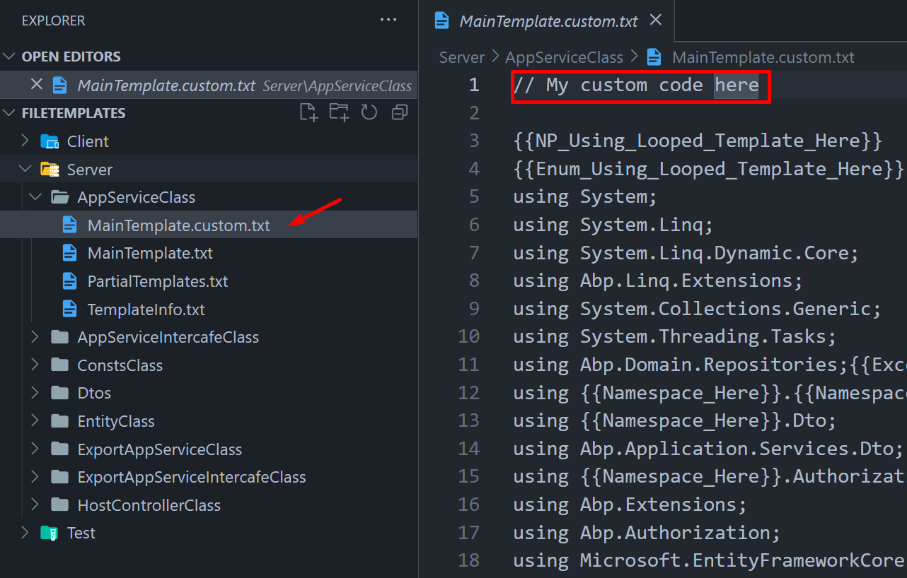

# How to Create & Edit Power Tools Templates

Power Tools uses text templates for code generation, and these templates are located inside `/AspNetZeroRadTool/FileTemplates` directory in your project's root directory.

**MainTemplate.txt:** Power Tools uses this template for main code generation.
**PartialTemplates.txt:** Power Tools renders some placeholders in `MainTemplate.txt` conditionally. These conditional templates are stored in `PartialTemplates.txt`.
**TemplateInfo.txt:** Stores information about the template like path and condition.

*Folder structure*


## Edit Pre-defined Templates

If you want to edit any file, copy it in the same directory and change it's an extension to `.custom.txt` from `.txt`. For example, you can create `MainTemplate.custom.txt` to override `MainTemplate.txt` in the same directory. Please don't make any changes to the original templates.



## Create New Templates

Choose a folder under the `FileTemplates` directory based on where the file you're creating in your project will reside (e.g., `Server`, `Client` -> `Mvc` or `Angular`, `Test`). Then, create a folder named after the file you’re creating. Inside this folder, create the following three files: `MainTemplate.txt`, `PartialTemplates.txt`, and `TemplateInfo.txt`.

You can use the existing templates as a reference. For guidance on how templates function and how to use placeholders, please refer to the documentation provided at [Understanding Power Tools Templates](power-tools-understanding-power-tools-templates.md).

Power Tools discovers templates in the `FileTemplates` directory every time it is run. So, restarting Power Tools will find your newly created templates.

### Example Custom Template

Let's say you want to create a new template for generating a new class in the `*.Core.Shared` project. It is an entity constant class that contains some constant values. Here is how you can create a new template for this:

1. Create a new folder named `CustomTemplate` under `AspNetZeroRadTool/FileTemplates/Server` directory.
	> Hint: You can use a prefix like ANZ to group your templates. For example, `ANZ_CustomTemplate`. Or refoldering, for example `FileTemplates\Server\MyTemplates\ANZ_CustomTemplate` This will help you to find your templates easily. 

2. Create `MainTemplate.txt`, `PartialTemplates.txt`, and `TemplateInfo.txt` files inside the `ConstantClass` folder.

**MainTemplate.txt**

```txt
{{Enum_Using_Looped_Template_Here}}
using System;

namespace {{Namespace_Here}}.{{Namespace_Relative_Full_Here}}
{
    public static class {{Entity_Name_Here}}CustomConsts
    {
        {{Property_Looped_Template_Here}}
    }
}
```

**PartialTemplates.txt**

```txt
{
"propertyTemplates":[
		{
			"placeholder" : "{{Property_Looped_Template_Here}}",
			"condition" : "",
			"templates" : [
					{
					"type" : "default",
					"content" : "public static readonly string {{Property_Name_Here}} = \"{{Property_Name_Here}}\";
					"
					},
				]
		}
	],
"navigationPropertyTemplates":[
	],
"enumTemplates":[
		{
			"placeholder" : "{{Enum_Using_Looped_Template_Here}}",
			"preventDuplicate":true,
			"content" : "using {{Enum_Namespace_Here}};"
		}
	],
}
```

**TemplateInfo.txt**

```txt
{
	"path" : "{{Namespace_Here}}.Core.Shared\\{{Namespace_Relative_Full_Reverse_Slash_Here}}\\{{Entity_Name_Here}}CustomConsts.cs",
	"condition": "{{Is_Master_Detail_Page_Child_Here}} == false",
}
```