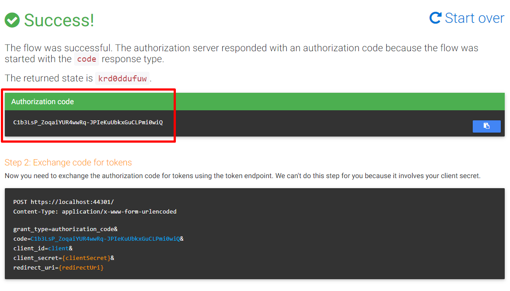

# OpenIddict Integration

[OpenIddict](https://documentation.openiddict.com/) aims at providing a versatile solution to implement OpenID Connect client, server and token validation support in any ASP.NET Core 2.1 (and higher) application.

## Configuration

You can enable/disable or configure it from **appsettings.json** file

```json
"OpenIddict": {
    "IsEnabled": "true",
    "Applications": [{
        "ClientId": "client",
        "ClientSecret": "def2edf7-5d42-4edc-a84a-30136c340e13",
        "DisplayName": "AbpZeroTemplate_App",
        "ConsentType": "Explicit",
        "RedirectUris": ["https://oauthdebugger.com/debug"],
        "PostLogoutRedirectUris": [],
        "Scopes": [
            "default-api",
            "profile"
        ],
        "Permissions": [
            "ept:token",
            "ept:authorization",
            "gt:password",
            "gt:client_credentials",
            "gt:authorization_code",
            "rst:code",
            "rst:code id_token"
        ]
    }]
}
```

* **IsEnabled**: Indicates if OpenIddict integration is enabled or not.
* **Applications**: List of OpenIddict applications.
  * **ClientId**: The client identifier associated with the current application.
  * **ClientSecret**: The client secret associated with the current application.
  * **DisplayName**: The display name associated with the current application.
  * **ConsentType**: The consent type associated with the current application (see [possible values](https://github.com/openiddict/openiddict-core/blob/dev/src/OpenIddict.Abstractions/OpenIddictConstants.cs#L178)). 
  * **RedirectUris**: The callback URLs associated with the current application, serialized as a JSON array.
  * **PostLogoutRedirectUris**: The logout callback URLs associated with the current application, serialized as a JSON array.
  * **Scopes**: The scopes associated with the current authorization, serialized as a JSON array (see [possible values](https://github.com/openiddict/openiddict-core/blob/dev/src/OpenIddict.Abstractions/OpenIddictConstants.cs#L402). You can also use custom values).
  * **Permissions**: The permissions associated with the current application, serialized as a JSON array (see [possible values](https://github.com/openiddict/openiddict-core/blob/dev/src/OpenIddict.Abstractions/OpenIddictConstants.cs#L360)).

## Testing with Client

ASP.NET Zero solution has a sample console application (ConsoleApiClient) that can connects to the application, authenticates through OpenIddict and calls an API.


## Testing with Web Client

You can use [https://oauthdebugger.com/](https://oauthdebugger.com/) website to test openIddict with a web client. 

Add a new Application to `*.Web.Host` appsettings.json

```json
...
{
    "ClientId": "client",
    "ClientSecret": "def2edf7-5d42-4edc-a84a-30136c340e13",
    "DisplayName": "AbpZeroTemplate_App",
    "ConsentType": "Explicit",
    "RedirectUris": ["https://oauthdebugger.com/debug"],
    "PostLogoutRedirectUris": [],
    "Scopes": [
        "default-api",
        "profile"
    ],
    "Permissions": [
        "ept:token",
        "ept:authorization",
        "gt:password",
        "gt:client_credentials",
        "gt:authorization_code",
        "rst:code",
        "rst:code id_token"
    ]
}
...
```

Then, go to [https://oauthdebugger.com/](https://oauthdebugger.com/) and create a URL for authorization code flow. A sample URL should be something like this;

```bash
https://localhost:44301/connect/authorize
?client_id=client
&redirect_uri=https://oauthdebugger.com/debug
&scope=default-api
&response_type=code
&response_mode=query
&state=krd0ddufuw
&nonce=fbhw5it86l6
```

Visit this URL using a browser. If you are not logged into your ASP.NET Zero application, you will be redirected to Login page. If you are already logged in, you will be redirected back to [https://oauthdebugger.com/](https://oauthdebugger.com/). Here, you will see the result of the request as shown below;



You can use this code to request an access token. You need to send a request to [https://localhost:44301/connect/token](https://localhost:44301/connect/token) endpoint. Here is a sample request using Postman.


Using this token, you can get details of the user using [https://localhost:44301/connect/userinfo](https://localhost:44301/connect/userinfo) endpoint or you can make a request to any ASP.NET Zero API service (for example [https://localhost:44301/api/services/app/User/GetUsers](https://localhost:44301/api/services/app/User/GetUsers)).

## OpenId Connect Integration

Once OpenIddict integration is enabled, Web.Host application becomes an OpenId Connect server. That means another web application can use standard OpenId Connect protocol to authenticate users with your
application and get permission to share their information (a.k.a. consent screen).

## More

See [OpenIddict's own documentation](https://documentation.openiddict.com/) to understand and configure OpenIddict.
